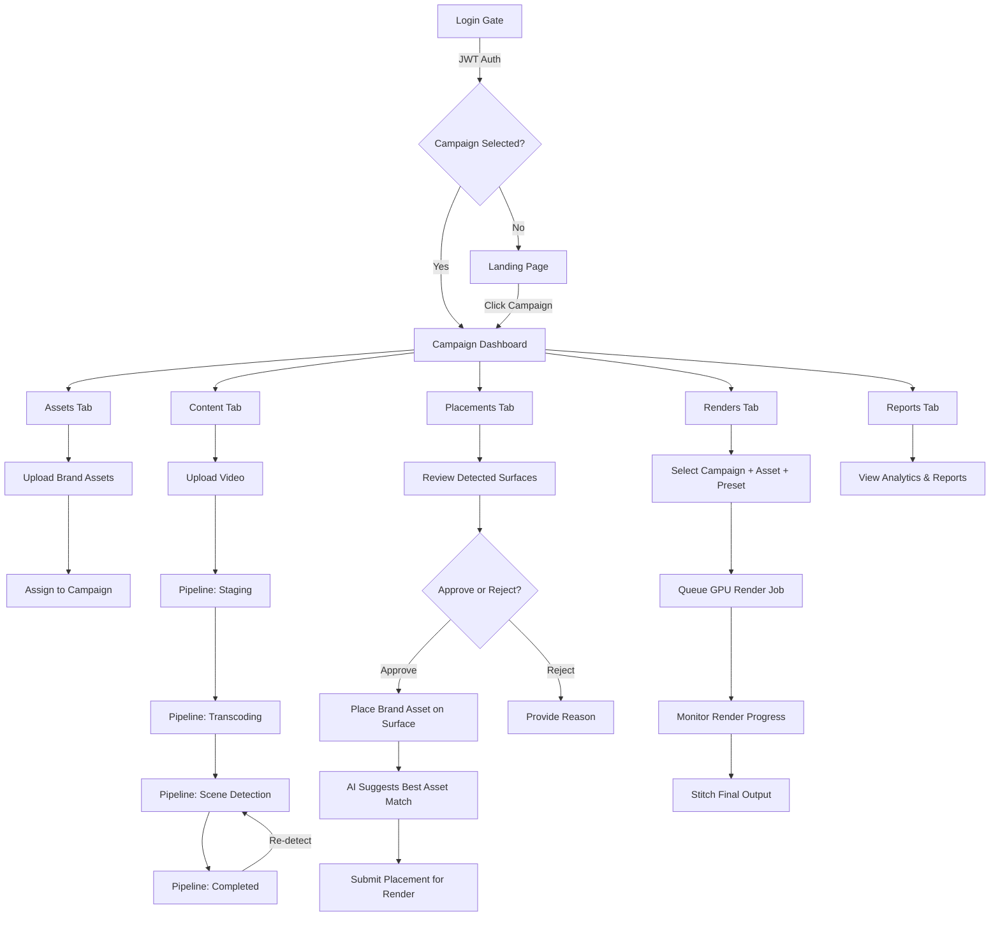
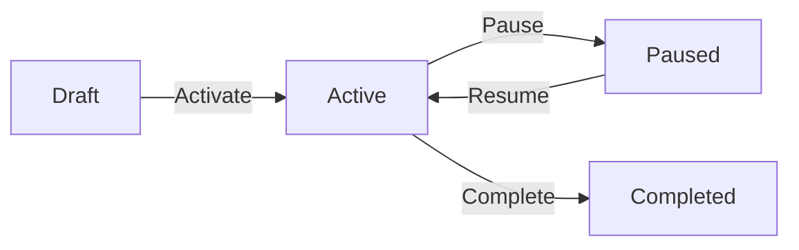

# Afrobotics BIT — Brand Insertion Technology

## Application Presentation & Architecture Overview

**Document Version:** 1.0
**Date:** 22 July 2026
**Status:** Engine Verification Ready

---

## Table of Contents

1. [Executive Summary](#1-executive-summary)
2. [Infrastructure & Technology Stack](#2-infrastructure--technology-stack)
3. [System Architecture](#3-system-architecture)
4. [Feature Catalogue](#4-feature-catalogue)
5. [User Roles & Permissions](#5-user-roles--permissions)
6. [Application Flow](#6-application-flow)
7. [Content Pipeline](#7-content-pipeline)
8. [API Surface](#8-api-surface)
9. [Security Architecture](#9-security-architecture)
10. [Database Schema](#10-database-schema)

---

## 1. Executive Summary

**Afrobotics Brand Insertion Technology (BIT)** is an AI-powered video inventory creation platform that enables brands to be inserted into existing video content after production. It transforms suitable surfaces inside video — billboards, screens, walls, signage, product spaces — into monetisable advertising inventory while appearing visually indistinguishable from the original scene.

### Vision

> *"Turn every surface in existing premium video content into a monetisable, brand-safe advertising opportunity — without disrupting the viewer experience."*

### Key Capabilities

- **Content Ingestion** — Accept video, transcode, detect scenes, extract metadata
- **AI Scene Analysis** — Computer-vision surface detection, depth estimation, orientation mapping
- **Placement Recommendation** — Score and rank candidate surfaces; brand-safety enforcement
- **Motion Tracking** — Lock brand assets to surfaces through camera movement
- **AI Compositing** — Perspective warp, relight, blur, shadow matching for photo-realism
- **GPU Rendering** — Batch render broadcast/streaming/social output
- **Campaign Management** — Advertiser campaigns, asset library, scheduling, regional targeting
- **Approval Workflow** — Mandatory human-in-the-loop approval; audit trail
- **Analytics & BI** — Exposure metrics, performance reporting, real-time dashboards
- **Enterprise Operations** — RBAC, JWT auth, event logging, alarms, redundancy

---

## 2. Infrastructure & Technology Stack

### 2.1 Infrastructure Diagram

```
┌─────────────────────────────────────────────────────────────────────┐
│                        CLIENT LAYER                                  │
│  ┌──────────────────────────────────────────────────────────────┐   │
│  │  React 19 SPA (Vite + TypeScript + TailwindCSS)              │   │
│  │  ┌──────────┐ ┌──────────┐ ┌──────────┐ ┌───────────────┐   │   │
│  │  │Dashboard │ │Ingestion │ │ Editor   │ │  Admin Panel  │   │   │
│  │  │ (Campaign│ │(Content  │ │(Scene QA │ │  (Users,      │   │   │
│  │  │  Views)  │ │ Upload)  │ │ Surface) │ │   Config)     │   │   │
│  │  └──────────┘ └──────────┘ └──────────┘ └───────────────┘   │   │
│  └──────────────────────────────────────────────────────────────┘   │
│                              │  HTTPS / JWT                          │
└──────────────────────────────┼───────────────────────────────────────┘
                               │
┌──────────────────────────────┼───────────────────────────────────────┐
│                        API GATEWAY LAYER                             │
│  ┌──────────────────────────────────────────────────────────────┐   │
│  │  .NET 8 Web API (C#)                                         │   │
│  │  ┌──────────┐ ┌──────────┐ ┌──────────┐ ┌───────────────┐   │   │
│  │  │  Auth    │ │ Content  │ │ Campaign │ │  Compositing  │   │   │
│  │  │Controller│ │Controller│ │Controller│ │  Controller   │   │   │
│  │  └──────────┘ └──────────┘ └──────────┘ └───────────────┘   │   │
│  │  ┌──────────┐ ┌──────────┐ ┌──────────┐ ┌───────────────┐   │   │
│  │  │ Scenes   │ │ Surfaces │ │ Renders  │ │Logs/Alarms    │   │   │
│  │  │Controller│ │Controller│ │Controller│ │Controller     │   │   │
│  │  └──────────┘ └──────────┘ └──────────┘ └───────────────┘   │   │
│  │                                                              │   │
│  │  Middleware: JWT Auth │ CORS │ Exception Handling            │   │
│  └──────────────────────────────────────────────────────────────┘   │
└──────────────────────────────┬───────────────────────────────────────┘
                               │
┌──────────────────────────────┼───────────────────────────────────────┐
│                        SERVICE LAYER                                 │
│  ┌──────────────────────────────────────────────────────────────┐   │
│  │  ┌──────────┐ ┌──────────┐ ┌──────────┐ ┌───────────────┐   │   │
│  │  │  Auth    │ │ Content  │ │ Campaign │ │   Surface     │   │   │
│  │  │ Service  │ │ Service  │ │ Service  │ │   Service     │   │   │
│  │  └──────────┘ └──────────┘ └──────────┘ └───────────────┘   │   │
│  │  ┌──────────┐ ┌──────────┐ ┌──────────┐ ┌───────────────┐   │   │
│  │  │  Render  │ │  Asset   │ │   Log    │ │  Compositing  │   │   │
│  │  │ Service  │ │ Service  │ │ Service  │ │  Service (I)  │   │   │
│  │  └──────────┘ └──────────┘ └──────────┘ └───────────────┘   │   │
│  └──────────────────────────────────────────────────────────────┘   │
└──────────────────────────────┬───────────────────────────────────────┘
                               │
┌──────────────────────────────┼───────────────────────────────────────┐
│                     REPOSITORY / DATA LAYER                          │
│  ┌──────────────────────────────────────────────────────────────┐   │
│  │  Generic IRepository<T> + Specialized Repositories           │   │
│  │  EF Core 8 → PostgreSQL (Npgsql)                             │   │
│  └──────────────────────────────────────────────────────────────┘   │
└──────────────────────────────┬───────────────────────────────────────┘
                               │
┌──────────────────────────────┼───────────────────────────────────────┐
│                     EXTERNAL SERVICES                                │
│  ┌──────────┐ ┌──────────┐ ┌──────────┐ ┌──────────┐ ┌──────────┐  │
│  │ Object   │ │ GPU      │ │ AI/ML    │ │ SMTP/    │ │ DSP/     │  │
│  │ Storage  │ │ Render   │ │ Models   │ │ SMS      │ │ Dist.    │  │
│  │(S3/Blob) │ │(RunPod/  │ │(Gemini/  │ │(SendGrid/│ │(Ad-      │  │
│  │          │ │ EC2 GPU) │ │ SAM2/etc)│ │ Twilio)  │ │ Server)  │  │
│  └──────────┘ └──────────┘ └──────────┘ └──────────┘ └──────────┘  │
└──────────────────────────────────────────────────────────────────────┘
```

### 2.2 Technology Stack

| Layer | Technology | Version |
|---|---|---|
| **Frontend Framework** | React (with Hooks, Context) | 19.0 |
| **Build Tool** | Vite | 6.2 |
| **Language** | TypeScript | 5.8 |
| **CSS Framework** | TailwindCSS | 4.1 |
| **Routing** | React Router DOM | 7.18 |
| **Animation** | Motion (Framer Motion) | 12.23 |
| **Icons** | Lucide React | 0.546 |
| **Backend Runtime** | .NET (ASP.NET Core) | 8.0 |
| **Language** | C# 12 | — |
| **ORM** | Entity Framework Core | 8.0 |
| **Database** | PostgreSQL (via Npgsql) | 16+ |
| **Authentication** | JWT Bearer | 8.0 |
| **Background Jobs** | Hangfire | 1.8 |
| **AI SDK (Client)** | Google GenAI (`@google/genai`) | 2.4 |
| **Password Hashing** | BCrypt.Net-Next | 4.2 |

### 2.3 Planned / Swappable Services

| Layer | Candidate Technologies | Status |
|---|---|---|
| **Scene Detection** | FFmpeg + custom scene-cut library | Build |
| **Segmentation / Object Detection** | SAM 2, YOLOv8, Detectron2 | TBC (Wrappable) |
| **Motion Tracking** | OpenCV planar tracker + point-tracking fallback | TBC (Wrappable) |
| **Compositing Engine** | Runway Gen-4 API, SAM 2 + IC-Light, proprietary homography solver | TBC (Swappable via `ICompositingService`) |
| **GPU Rendering** | RunPod, AWS EC2 GPU (G5 instances), FFmpeg, Blender | TBC |
| **Object Storage** | AWS S3, Azure Blob Storage, MinIO (on-prem) | TBC |
| **Notifications** | SendGrid/Mailgun (SMTP), Twilio/Africa's Talking (SMS) | TBC |
| **Message Queue** | RabbitMQ, Azure Service Bus, AWS SQS | TBC |
| **Containerization** | Docker, Kubernetes (AKS/EKS) | Planned |

---

## 3. System Architecture

### 3.1 Architectural Patterns

| Pattern | Usage |
|---|---|
| **Layered Architecture** | Controllers → Services → Repositories → Database |
| **Repository Pattern** | Generic `IRepository<T>` with specialized interfaces per aggregate |
| **Strategy Pattern** | `ICompositingService`, `ISurfaceDetectionService`, `IBrandAnalysisService` allow swapping AI engines without re-architecting |
| **Dependency Injection** | All services registered in DI container (`Program.cs`) |
| **JWT Token Auth** | Stateless authentication via Bearer tokens |
| **SPA with API Proxy** | Vite dev proxy `/api` → .NET backend; same origin in production |

### 3.2 Engine Swappability

The platform supports runtime-configurable AI engines via `IPlatformSettingsService`:

| Capability | Interface | Available Engines |
|---|---|---|
| **Surface Detection** | `ISurfaceDetectionService` | `basic` (default), `replicate` (Replicate API), `google` (Google Vision) |
| **Brand Analysis** | `IBrandAnalysisService` | `basic` (default), `google` (Google Vision), `gemini` (Gemini) |
| **Compositing** | `ICompositingService` | `basic` (default), `opencv` (OpenCV) |

Admin changes engine settings via the Admin Console → Settings → Engine tab. Changes take effect on next app restart.

### 3.3 Middleware Pipeline

```
HTTP Request
  → CORS (AllowFrontendClient)
  → Authentication (JWT Bearer)
  → Authorization
  → UsageTrackingMiddleware (MReq 22)
  → Controller
  → ExceptionHandlingMiddleware (production only)
  → HTTP Response
```

---

## 4. Feature Catalogue

### 4.1 Frontend Features

| Module | Component | Description |
|---|---|---|
| **Authentication** | Login Gate (`App.tsx`) | Secure sign-in with pre-configured role cards, forgot password, token refresh, idle timeout (28min + 60s countdown) |
| **Theme System** | Theme Toggle | Dark/Light mode switch, persisted to `localStorage`, full Tailwind dark mode coverage (cards, inputs, tables, text, borders) |
| **Campaign Workspace** | `CampaignDashboard` | Per-campaign pipeline progress, budget/region/asset/render stats, quick-action cards |
| **Campaign Sidebar** | `CampaignSidebar` | URL-driven navigation (dashboard, assets, content, placements, renders, reports, admin, telemetry, analytics) |
| **Campaign Selector** | `CampaignSelector` | Dropdown campaign switcher with asset counts, direct navigation |
| **Asset Management** | `CampaignsTab` | Create/edit/delete creative assets, file upload, brand category assignment, campaign association/unassociation |
| **Content Ingestion** | `IngestionTab` | Video upload with chunked upload (>100MB), progress bar, pipeline stage indicators, delete content, AI scene detection trigger |
| **Pipeline Controls** | `IngestionTab` | Re-transcode, Re-detect Scenes, Reset Pipeline buttons with loading states and error messages |
| **Pipeline Progress** | `PipelineProgress` | Visual 4-step progress indicator (Staging→Transcoding→SceneDetection→Completed) |
| **QA Workbench** | `EditorTab` | Scene/surface browsing, surface approval/rejection with reason, asset placement on surfaces, AI asset suggestions, compositing preview |
| **Scene Approval** | `EditorTab` | Scene-level approval workflow, AI-generated scene metadata display |
| **GPU Compositing** | `ComposerTab` | Campaign→Asset→Preset selection, render queue with status, stitching console simulator |
| **Telemetry** | `TelemetryTab` | Paginated event logs with severity/search filters, paginated alarms with active/resolved toggle, alarm simulation, alarm clearing |
| **Analytics** | `AnalyticsTab` | 8 summary cards (Total Content, Scenes Indexed, Ad Surfaces, Renders, Active Campaigns, Active Alarms, Content 7d, Renders 7d), average render time |
| **Admin Console** | `AdminConsoleTab` | User CRUD (create/edit/suspend/delete), platform settings (SMTP/Upload/Pipeline/Engine), brand-safety exclusion list, role requests panel |
| **Brand Safety** | `BrandSafetyPanel` | Permanent exclusion list — add-only, toggle active/inactive, category + description |
| **Role Requests** | `RoleRequestsPanel` | Approve/reject role elevation requests with filter (All/Pending/Approved/Rejected) |
| **Settings** | `SettingsPanel` | SMTP config, upload limits, pipeline thresholds, AI engine selection, test email button |
| **Notifications** | `AttentionBell` | Real-time attention message notifications |
| **Notification Prefs** | `NotificationPreferencesPanel` | Per-user mute toggles for notification types (RenderCompleted, CampaignCreated, etc.) |

### 4.2 Backend Features

| Module | Controllers | Description |
|---|---|---|
| **Auth** | `AuthController` | Login, token refresh, forgot password, change password |
| **Users** | `UsersController` | CRUD, role management, account status |
| **User Profile** | `UserProfileController` | Current user profile, notification preferences |
| **Role Requests** | `AdminRoleRequestsController` | List, approve, reject role elevation requests |
| **Content** | `ContentController` | Upload (chunked + direct), list, delete, scene detection trigger, pipeline stage transitions |
| **Scenes** | `ScenesController` | List scenes per content, update QA status, AI scene analysis |
| **Surfaces** | `SurfacesController` | List surfaces per scene, approve/reject with audit trail |
| **Campaigns** | `CampaignsController` | CRUD, naming code validation |
| **Assets** | `AssetsController` | CRUD, file upload, campaign association/unassociation |
| **Renders** | `RendersController` | Queue render jobs, list renders, status tracking |
| **Compositing** | `CompositingController` | Preview composite frame generation |
| **Approvals** | `ApprovalsController` | Approval audit trail |
| **Alarms** | `AlarmsController` | List, trigger, clear alarms |
| **Logs** | `LogsController` | Event log retrieval with pagination and filters |
| **Notifications** | `NotificationsController` | Send and manage notifications |
| **Stats** | `StatsController` | Platform summary statistics |
| **Usage** | `UsageController` | Usage record tracking and archiving |
| **Brand Safety** | `BrandSafetyController` | Add/toggle brand safety exclusion rules |
| **Admin Settings** | `AdminSettingsController` | Platform settings CRUD, test email endpoint |
| **Attention** | `AttentionController` | Attention message management |

### 4.3 Background Jobs (Hangfire)

| Job | Schedule | Description |
|---|---|---|
| **Cleanup Chunk Temp** | Daily | Removes orphaned chunked upload temp directories |
| **Archive Usage Records** | Weekly | Archives old usage tracking records |

---

## 5. User Roles & Permissions

### 5.1 Role Definitions

| Role | Access Level | Capabilities |
|---|---|---|
| **Admin** | Full Platform | User management, platform settings, brand-safety rules, role request review, all campaign views, content ingestion, QA workbench, render queue, telemetry, analytics |
| **Editor** | Operational | Campaign workspace, content ingestion, scene QA, surface approval, asset management, render queue, telemetry, analytics. No user management or platform settings. |
| **Advertiser** | Campaign-Focused | Campaign dashboard, asset upload, placement review, render status, reports. Read-only on content & telemetry. |

### 5.2 Pre-Seeded Users

| Name | Email | Password | Role |
|---|---|---|---|
| Sabelo Nkosi | `admin@afrobotics.co.za` | `admin123` | Admin |
| Sfiso Dlamini | `loverboy.sfiso@gmail.com` | `editor123` | Editor |
| Thabo Ndlovu | `advertiser@afrobotics.co.za` | `advertiser123` | Advertiser |

### 5.3 Role Request Workflow

```
Editor/Advertiser → "Request Role" button → Submit request with reason
    → Admin reviews in Admin Console → Approve/Reject
    → Role updated immediately if approved
```

---

## 6. Application Flow

### 6.1 User Journey (End-to-End)



### 6.2 Campaign Lifecycle



### 6.3 URL Routing Structure

```
/                               → Landing page (no campaign selected)
/c/:campaignId                  → Campaign Dashboard
/c/:campaignId/assets           → Asset Management
/c/:campaignId/content          → Content Ingestion
/c/:campaignId/placements       → QA Workbench & Placements
/c/:campaignId/renders          → GPU Compositing & Renders
/c/:campaignId/reports          → Campaign Reports
/admin                          → Admin Console
/telemetry                      → Telemetry (Logs & Alarms)
/analytics                      → Platform Analytics
```

---

## 7. Content Pipeline

### 7.1 Pipeline Stages

```
┌──────────┐    ┌─────────────┐    ┌────────────────┐    ┌───────────┐
│          │    │             │    │                │    │           │
│ Staging  │───▶│ Transcoding │───▶│ SceneDetecting │───▶│ Completed │
│          │    │             │    │                │    │           │
└────┬─────┘    └──────┬──────┘    └───────┬────────┘    └─────┬─────┘
     │                 │                   │                   │
     │                 │                   │                   │
     ▼                 ▼                   ▼                   ▼
┌──────────┐    ┌──────────┐       ┌──────────┐       ┌──────────┐
│  Failed  │    │  Failed  │       │  Failed  │       │Re-detect │
│          │◀───│          │◀──────│          │       │ Scenes   │
└────┬─when sfiso
───┘    └──────────┘       └──────────┘       └──────────┘

     │
     │ (retry)
     ▼
┌──────────┐
│ Staging  │
└──────────┘
```

### 7.2 Stage Transitions

| From | To | Trigger |
|---|---|---|
| Staging | Transcoding | Automatic after upload |
| Staging | Failed | Upload/validation error |
| Transcoding | SceneDetecting | Automatic after transcode |
| Transcoding | Failed | Transcode error |
| SceneDetecting | Completed | Automatic after detection |
| SceneDetecting | Failed | Detection error |
| Completed | SceneDetecting | Manual "Re-detect Scenes" |
| Failed | Staging | Manual "Reset Pipeline" |
| Any | Failed | Manual "Mark Failed" |

### 7.3 Pipeline Timestamps

Each content item tracks precise timestamps for every pipeline stage:

- `StagingCompletedAt`
- `TranscodingStartedAt` / `TranscodingCompletedAt`
- `SceneDetectingStartedAt` / `SceneDetectingCompletedAt`
- `LastErrorMessage` / `LastErrorAt`

### 7.4 Upload System

| File Size | Method | Features |
|---|---|---|
| ≤ 100 MB | Direct XHR Upload | Progress bar, real-time percentage |
| > 100 MB | Chunked Upload | 25 MB chunks, 3 concurrent, resume support |

---

## 8. API Surface

### 8.1 API Endpoints Summary

| Controller | Base Path | Key Endpoints |
|---|---|---|
| **Auth** | `/api/auth` | `POST /login`, `POST /refresh`, `POST /forgot-password`, `POST /change-password` |
| **Users** | `/api/users` | `GET /`, `POST /`, `PUT /{id}`, `DELETE /{id}` |
| **User Profile** | `/api/user` | `GET /profile`, `PUT /notifications`, `POST /request-role` |
| **Admin Role Requests** | `/api/admin/role-requests` | `GET /`, `POST /{id}/approve`, `POST /{id}/reject` |
| **Content** | `/api/content` | `GET /`, `POST /upload`, `DELETE /{id}`, `POST /{id}/transition`, `POST /{id}/retranscode`, `POST /{id}/redetect-scenes`, `POST /{id}/mark-failed`, `POST /{id}/reset`, `GET /{id}/scenes` |
| **Scenes** | `/api/scenes` | `GET /{id}/surfaces`, `POST /update`, `POST /ai-suggest-assets` |
| **Surfaces** | `/api/surfaces` | `POST /{id}/approve` |
| **Campaigns** | `/api/campaigns` | `GET /`, `POST /`, `PUT /{id}`, `DELETE /{id}` |
| **Assets** | `/api/assets` | `GET /`, `POST /`, `POST /upload`, `PUT /{id}`, `PUT /{id}/upload`, `DELETE /{id}`, `PUT /{id}/campaign/{campaignId}`, `PUT /{id}/unassociate` |
| **Renders** | `/api/renders` | `GET /`, `POST /` |
| **Compositing** | `/api/compositing` | `POST /preview` |
| **Approvals** | `/api/approvals` | `GET /`, `POST /` |
| **Alarms** | `/api/alarms` | `GET /`, `POST /trigger`, `POST /{id}/clear` |
| **Logs** | `/api/logs` | `GET /`, `POST /` |
| **Notifications** | `/api/notifications` | `GET /`, `POST /` |
| **Stats** | `/api/stats` | `GET /summary` |
| **Usage** | `/api/usage` | `GET /`, `POST /archive` |
| **Brand Safety** | `/api/admin/brand-safety` | `GET /`, `POST /`, `POST /{id}/toggle` |
| **Admin Settings** | `/api/admin/settings` | `GET /`, `PUT /`, `POST /test-email` |
| **Attention** | `/api/attention` | `GET /`, `POST /` |

### 8.2 Pagination

All list endpoints support pagination with a consistent response shape:

```json
{
  "items": [...],
  "totalCount": 150,
  "page": 1,
  "pageSize": 25,
  "totalPages": 6,
  "hasPreviousPage": false,
  "hasNextPage": true
}
```

Query parameters: `?page=1&pageSize=25&severity=Critical&search=keyword`

---

## 9. Security Architecture

### 9.1 Authentication Flow

```
User → Login Form → POST /api/auth/login
    → Server validates email + BCrypt password hash
    → Server returns JWT token (8hr expiry) + user session
    → Client stores token in localStorage
    → All subsequent requests include: Authorization: Bearer <token>
    → Silent token refresh every 30 minutes (2hr refresh window)
    → Idle timeout: 28 min inactivity → 60s countdown → auto-logout
```

### 9.2 Security Measures

| Measure | Implementation |
|---|---|
| **Password Hashing** | BCrypt (BCrypt.Net-Next) |
| **JWT Signing** | HMAC-SHA256 with configurable secret |
| **Token Expiry** | 8 hours (configurable via `Jwt:ExpiryHours`) |
| **Token Refresh** | Silent refresh within 2-hour window (`Jwt:RefreshWindowHours`) |
| **Idle Timeout** | 28 minutes → 60s countdown → forced logout |
| **CORS** | Whitelist: `localhost:3000`, `*.run.app` |
| **Exception Handling** | Production middleware catches unhandled errors, returns generic messages |
| **Error Interception** | Frontend intercepts 500-range and network errors with friendly messages |
| **Authorization** | Role-based access control on both frontend (URL guard) and backend (`[Authorize]` attributes) |

---

## 10. Database Schema

### 10.1 Entity Relationship Diagram

```
┌──────────┐       ┌──────────────┐       ┌─────────────┐
│   User   │       │ CampaignItem │       │ CreativeAsset│
│──────────│       │──────────────│       │──────────────│
│ Id (PK)  │       │ Id (PK)      │       │ Id (PK)      │
│ FullName │       │ Name         │       │ Name         │
│ Email    │       │ NamingCode   │       │ Type         │
│ Role     │       │ ScheduleStart│       │ StorageKey   │
│ Status   │       │ ScheduleEnd  │       │ CampaignId FK│
└──────────┘       │ TargetRegion │       └──────┬───────┘
                   │ Budget       │              │
                   │ Status       │              │
                   └──────┬───────┘              │
                          │                      │
    ┌─────────────────────┼──────────────────────┘
    │                     │
    │              ┌──────┴───────┐
    │              │  CampaignItem │ (1 campaign → many assets)
    │              └──────────────┘
    │
    │  ┌──────────────┐       ┌──────────────┐
    │  │ ContentItem  │ 1───* │  SceneItem   │
    │  │──────────────│       │──────────────│
    │  │ Id (PK)      │       │ Id (PK)      │
    │  │ Title        │       │ ContentId FK │
    │  │ Duration     │       │ StartFrame   │
    │  │ Resolution   │       │ EndFrame     │
    │  │ FrameRate    │       │ SceneIndex   │
    │  │ StorageKey   │       │ DurationSec  │
    │  │ IngestionStat│       │ QaStatus     │
    │  │ CampaignId FK│       │ AiPrompt     │
    │  └──────────────┘       │ AiStatus     │
    │                         │ AiModel      │
    │                         └──────┬───────┘
    │                                │ 1───*
    │                         ┌──────┴───────┐
    │                         │ SurfaceItem  │
    │                         │──────────────│
    │                         │ Id (PK)      │
    │                         │ SceneId FK   │
    │                         │ SurfaceType  │
    │                         │ BoundaryJSON │
    │                         │ Depth        │
    │                         │ Orientation  │
    │                         │ Confidence   │
    │                         │ Viability    │
    │                         │ Status       │
    │                         └──────┬───────┘
    │                                │ 1───*
    │                         ┌──────┴───────┐
    │                         │  AdSlotItem  │
    │                         │──────────────│
    │                         │ Id (PK)      │
    │                         │ SurfaceId FK │
    │                         │ MarketRegion │
    │                         │ PricingValue │
    │                         │ SlotStatus   │
    │                         │ CampaignId FK│
    │                         └──────┬───────┘
    │                                │
    │                         ┌──────┴───────┐
    │                         │ ApprovalItem │
    │                         │──────────────│
    │                         │ Id (PK)      │
    │                         │ AdSlotId FK  │
    │                         │ CampaignId FK│
    │                         │ ApproverId   │
    │                         │ Decision     │
    │                         └──────────────┘
    │
    │  ┌──────────────┐
    │  │  RenderItem  │
    │  │──────────────│
    │  │ Id (PK)      │
    │  │ ContentId FK │
    │  │ SurfaceId FK │
    │  │ CampaignId FK│
    │  │ AssetId FK   │
    │  │ ExportPreset │
    │  │ StorageKey   │
    │  │ RenderStatus │
    │  │ Progress     │
    │  └──────────────┘
```

### 10.2 Operational Entities

| Entity | Purpose |
|---|---|
| **EventLog** | System event logging (auth, ingestion, AI, GPU, errors) |
| **AlarmItem** | Active/resolved alarms with severity (Minor/Major/Critical) |
| **UsageRecord** | Per-user API request tracking |
| **NotificationItem** | Email/SMS notification queue |
| **PlatformSetting** | Runtime-configurable settings (DB-backed, appsettings.json fallback) |
| **RoleRequest** | Role elevation requests with approval workflow |
| **BrandSafetyRule** | Permanent exclusion categories (add-only, toggle active/inactive) |
| **PasswordResetToken** | Time-limited password reset tokens |

### 10.3 Seed Data Summary

When the application starts in Development mode, the following seed data is populated:

| Entity | Count | Examples |
|---|---|---|
| **Users** | 3 | Admin, Editor, Advertiser |
| **ContentItems** | 3 | Soccer derby (1080p/50fps), drone survey (4K/60fps), living room test (1080p/25fps) |
| **SceneItems** | 5 | 3 scenes for derby, 2 scenes for drone footage |
| **SurfaceItems** | 5 | LED board, face (excluded), grass mat, Coca-Cola sign (excluded), highway gantry |
| **CampaignItems** | 3 | Coca-Cola SADC (Active), Nike AirMax (Active), Samsung Neo-QLED (Draft) |
| **CreativeAssets** | 3 | Coke banner, Nike swoosh, Samsung video overlay |
| **RenderItems** | 1 | Finished ProRes render (42.5s processing) |
| **EventLogs** | 4 | Auth success, FFmpeg metadata, brand-safety exclusion, GPU export |
| **AlarmItems** | 2 | Minor SMTP delay (cleared), Critical GPU VRAM timeout (active) |

---

## Appendix A: Quick Start

### Prerequisites

- Node.js 18+
- .NET 8 SDK
- PostgreSQL 16+ (local or remote)
- Gemini API key (for AI features; optional for basic mode)

### Startup Commands

```bash
# 1. Install frontend dependencies
npm install

# 2. Set Gemini API key (optional)
# Create .env.local with: GEMINI_API_KEY=your_key_here

# 3. Ensure PostgreSQL is running with database 'afrobotics_bit'
# Connection: Host=localhost;Database=afrobotics_bit;Username=postgres;Password=Password@1

# 4. Start backend (applies migrations + seeds on first run)
dotnet run --project dotnet-api/Afrobotics.Bit.Api.csproj

# 5. Start frontend (separate terminal)
npx vite --host 0.0.0.0 --port 3000

# 6. Open browser
# http://localhost:3000
```

### Login Credentials

| Role | Email | Password |
|---|---|---|
| Admin | `admin@afrobotics.co.za` | `admin123` |
| Editor | `loverboy.sfiso@gmail.com` | `editor123` |
| Advertiser | `advertiser@afrobotics.co.za` | `advertiser123` |

---

## Appendix B: File Structure

```
BIT-APP/
├── index.html                          # SPA entry point
├── package.json                        # Frontend dependencies & scripts
├── tsconfig.json                       # TypeScript configuration
├── vite.config.ts                      # Vite build config + API proxy
├── metadata.json                       # AI Studio metadata
├── README.md                           # Original AI Studio README
│
├── docs/
│   ├── DESIGN_DOCUMENT.md              # Full system design specification
│   └── APPLICATION_PRESENTATION.md     # ← This file
│
├── src/                                # React Frontend
│   ├── main.tsx                        # App entry (BrowserRouter)
│   ├── App.tsx                         # Root component (auth, routing, state)
│   ├── index.css                       # Tailwind imports + dark mode overrides
│   ├── types.ts                        # TypeScript interfaces & constants
│   ├── apiClient.ts                    # HTTP client (JWT, pagination, login)
│   ├── document.ts                     # Implementation plan document
│   ├── components/
│   │   ├── AdminConsoleTab.tsx         # User management + admin panels
│   │   ├── AnalyticsTab.tsx            # Platform analytics dashboard
│   │   ├── AttentionBell.tsx           # Notification bell
│   │   ├── BrandSafetyPanel.tsx        # Brand-safety exclusion list
│   │   ├── CampaignDashboard.tsx       # Campaign-level dashboard
│   │   ├── CampaignSelector.tsx        # Campaign dropdown picker
│   │   ├── CampaignSidebar.tsx         # URL-driven sidebar navigation
│   │   ├── CampaignsTab.tsx            # Asset management & campaign view
│   │   ├── ComposerTab.tsx             # GPU render queue & stitching
│   │   ├── EditorTab.tsx               # QA workbench & placement editor
│   │   ├── FilterableSelect.tsx        # Searchable dropdown component
│   │   ├── IngestionTab.tsx            # Video upload & pipeline control
│   │   ├── NotFoundPage.tsx            # 404 page
│   │   ├── NotificationPreferencesPanel.tsx
│   │   ├── Pagination.tsx              # Reusable pagination component
│   │   ├── PipelineProgress.tsx        # 4-stage pipeline indicator
│   │   ├── RoleRequestsPanel.tsx       # Admin role request management
│   │   ├── SettingsPanel.tsx           # Platform settings editor
│   │   └── TelemetryTab.tsx            # Logs & alarms viewer
│   └── hooks/
│       ├── useChunkedUpload.ts         # Chunked upload hook
│       ├── useIdleTimer.ts             # Session idle timeout hook
│       └── usePaginatedData.ts         # Paginated API data hook
│
├── dotnet-api/                         # .NET 8 Backend
│   ├── Afrobotics.Bit.Api.csproj       # Project file with NuGet references
│   ├── Program.cs                      # App startup, DI, middleware, Hangfire
│   ├── appsettings.json                # Configuration (DB, JWT, SMTP, engines)
│   ├── HangfireDashboardAuthFilter.cs  # Hangfire dashboard auth
│   ├── Controllers/                    # 20 API controllers
│   ├── Models/Models.cs                # All entity classes
│   ├── Data/
│   │   ├── PostgresDbContext.cs        # EF Core DbContext
│   │   └── DbSeeder.cs                 # Development seed data
│   ├── DTOs/                           # Data transfer objects
│   ├── Middleware/                     # Exception & usage tracking
│   ├── Migrations/                     # EF Core migrations
│   ├── Repositories/                   # Generic + specialized repos
│   └── Services/                       # 27 service files
│
├── dotnet-api.Tests/                   # xUnit test project
│   ├── Afrobotics.Bit.Tests.csproj
│   ├── AuthServiceTests.cs
│   ├── CampaignServiceTests.cs
│   └── SurfaceServiceTests.cs
│
└── .github/
    └── agents/
        └── plan-executor.agent.md      # Plan execution agent definition
```

---

*End of Document — Afrobotics BIT Application Presentation v1.0*
